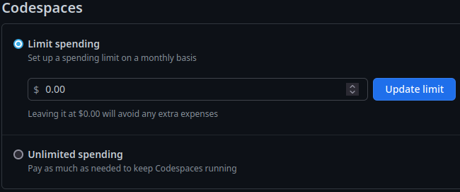
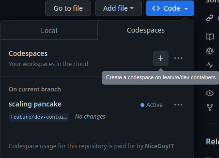

# Contributing

## Contributing to the Docs

The source of the docs are <https://github.com/amidaware/trmm-docs>

Docs are built with [MKDocs for Material](https://squidfunk.github.io/mkdocs-material/)

Please refer to the docs [README](https://github.com/amidaware/trmm-docs) for instructions on how to build and serve the docs locally.

Open your browser and navigate to `http://yourserverip:8005`

Add/edit markdown files in the `docs/docs` folder and you'll see live changes at the url above.

Edit `docs/mkdocs.yml` to edit structure and add new files.

Full MKDocs documentation [here](https://squidfunk.github.io/mkdocs-material/getting-started/)

Once finished, [create a pull request](https://www.digitalocean.com/community/tutorials/how-to-create-a-pull-request-on-github) to the `main` branch for review.

## Contributing using GitHub Codespaces

[Devcontainers](https://devcontainers.org/) is an open specification for developing with a preconfigured container setup. With devcontainers, you don't need SSH keys, `git clone`, or deal with the usual "local setup" tasks. Everything is configured in the container and you connect to it remotely. GitHub Codespaces is GitHub's version of devcontainers. Authentication is provided via your GitHub account. Before you start a Codespace, there are a few settings you should to be aware of.

### Cost and spending limit

GitHub provides 120 core hours and 15 GB-month storage for free accounts. Please [read GitHub's notes](https://docs.github.com/en/billing/managing-billing-for-github-codespaces/about-billing-for-github-codespaces#monthly-included-storage-and-core-hours-for-personal-accounts) in detail to understand how much that provides. For clarity, here is the explanation of GB-month storage and core hour compute usage.

- The GB-month unit of storage is a time-based measurement, 1 GB-month being 1 GB of storage usage for one whole month. The disk space used by all of your codespaces and prebuilds is assessed once an hour and your current GB-month usage is recalculated. Therefore, while you have codespaces and prebuilds, your GB-month usage will increase throughout the month. For example, if the storage totals 15 GB, and remains unchanged throughout your monthly billing cycle, then you will have used 7.5 GB halfway through the month, and 15 GB at the end of the month. For more information, see "About billing for storage usage" later in this article.
- A "core hour" is a measure used for included compute usage. To calculate core hours, multiply the number of hours for which a codespace has been active by the multiplier in the pricing table later in this article. For the basic machine types, the multiplier is the number of processor cores in the machine that hosts the codespace. For example, if you use a 2-core machine for your codespace and it's active for an hour, you have used 2 core hours. If you use an 8-core machine for an hour, you have used 8 core hours. If you use an 8-core machine for two hours, you have used 16 core hours.

----
By default, the [spending limit](https://docs.github.com/en/billing/managing-billing-for-github-codespaces/managing-the-spending-limit-for-github-codespaces#managing-the-github-codespaces-spending-limit-for-your-personal-account) is $0. This means the devcontainer will stop after the free tier has been exhausted.

### Creating the codespace

Codespaces are created by clicking the `code` button and then the Codespaces tab. **Codespaces are specific to a branch!** If needed, create a new branch for your changes. Clicking the `+` will create the Codespace. **Codespaces are paid for by you** using the spencing limit mentioned above. This screenshot is from my account where I already have a codespace on this branch, `scaling pancake`.

### Using the Codespace

It takes about 15 seconds for the Codespace to start in the browser. If you want to use Code on the desktop, click the `Codespaces` in the lower left corner (to open the command menu at top) and selection the option to "Open in VS Code Desktop". Once VS Code is open on the desktop, you can close the browser tab.

### Committing your code

As stated above, you don't need SSH keys to commit your changes. The Codespace is already authenticated with your GitHub account, and `git push` "just works(tm)". Of course you still need to `git add --update` or `git add .` followed by `git commit --message "Some descriptive message for your change"`.

### Stopping the Codespace

After committing your message, stop the Codespace by clicking the `Codespaces` in the lower left corner (to open the command menu at top) and selection the option to "Stop Current Codespace". See the screenshot above.

### Deleting the Codespace

Since you are billed for storage on a GB-month basis, it's best to delete the Codespace. _Codespaces are disposable!_ Go to <https://github.com/codespaces/> to view all your codespaces. Clicking on the Codespace will launch it! Instead, click the kebab menu on the right and select Delete.

### Help! Something's wrong

Remember, _Codespaces are disposable!_ If something is wrong, go to your Codespace dashboard, <https://github.com/codespaces/>, and delete the Codespace. Uncommitted changes will be deleted. Create another Codespace and try again.

### Wrapping up

Codespaces help the developer workflow but it doesn't replace the pull request process. You still need to submit the pull request like you normally would. The main advantage of using Codespaces is not having to `git clone` the repository.
